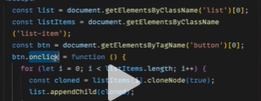

HTMLCollection & NodeList 的区别是什么？

1、我们要知道这个问题问的是什么？
答：HTMLCollection 和 NodeList 都是 DOM 元素的集合类型。区分这两种的区别，需要了解它们各自的特点。

2、HTMLCollection 特点是什么？ 有哪些问题？
HTMLCollection是早些时候我们通过document.getElementByTag|document.getElementsByClassName获取的dom伪数组集合类型。
它的特点是实时的 也就是说你如果操作页面种的dom元素 将会导致HTMLCollection伪数组长度会发生变化
也会导致存在潜在的问题 超出预期的问题 如我们通过HTMLCollection进行dom的克隆 就会发现死循环

就会发现出现问题了

3、NodeList 是什么？
NodeList是我们通过document.querySelectorAll获取的dom伪数组集合类型。
它不是实时的 不和页面绑定