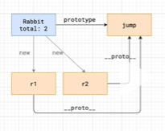

实例成员和静态成员

类可以通过 static 标记伪静态方法和成员

实例成员和静态成员的区别分为：内存方面 和 语义方面 两大方面

静态成员的使用 通过类目.静态成员来修改
例如 类目 Text 静态属性 color 通过 Text.Color获取
而不是通过 this.color

内存方面：

我们可以看到 类 本质就是一个函数 函数也是对象 静态方法就是函数内的变量和方法 实例成员和方法 通过原型链和类相互关系
实例成员 通过原型链使用实例方法 而不能使用静态方法

语义上：
。。。
