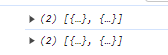
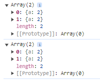
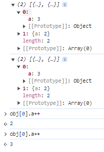

// 问题：浏览器打印对象的 bug  在node环境没有问题
// 问题重现:

```
const obj = [{ a: 1 }, { a: 2 }]
console.log(obj)
obj[0].a++;
console.log(obj)
```

我们会发现浏览器打印出两个缩略的对象
这是浏览器减少内存的一个小处理
只有当我们展开详情 他才会实时的去计算值



也就是每次操作 只有在第一次展开的时候 他才会去计算


所以尽量使用断点调试 或者操作前 对对象进行深拷贝
