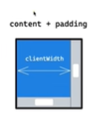
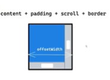
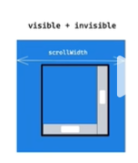

获取元素的尺寸

获取元素尺寸的 方法 很多 我们要了解每个方法对应的尺寸特点

1、通过 getComputedStyle(dom).width 方法获取元素尺寸 直接读元素的样式 这个获取的尺寸是 Cssom 中的尺寸 不一定是界面是的尺寸

2、ele.style.width 这个是十分错误的 读取dom树 因为 ele.style.width 只能获取到行内样式 如果没有width就读取不到 

3、clientWidth 获取元素内部宽度 包括padding 不包括border 滚动条

4、offsetWidth 获取元素内部宽度 包括padding border 滚动条

5、scrollWidth 不是元素本身的尺寸 而是滚动条情况下 里面的尺寸

6、getBoundingClientRect() 获取尺寸 且这不在是布局树 而是浏览器绘制的最后一步 人眼看到的尺寸了 可获取transform的变化

总结：clientWidth、offsetWidth、scrollWidth 读取的都是layout布局树的尺寸 不能够得到transform后的尺寸 getBoundingClientRect可以获取transform后的尺寸 transform本质就是矩阵计算 在GPU上进行